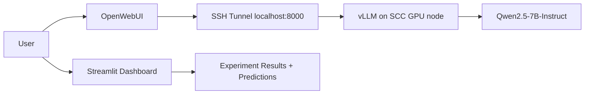

# OpenWebUI + SCC Deployment Plan

## Short answer

Yes, the model can be used with OpenWebUI while running on BU SCC, but the best architecture is:

1. `SCC` runs the model server on a GPU node using `vLLM`.
2. `OpenWebUI` runs outside SCC, either on your laptop or on a small VM.
3. An SSH tunnel connects OpenWebUI to the SCC-hosted model endpoint.

This is better than trying to keep a full OpenWebUI site permanently hosted on SCC.

## Why this is the recommended design

- OpenWebUI supports any OpenAI-compatible backend.
- OpenWebUI documents direct integration with `vLLM` using a base URL like `http://localhost:8000/v1`.
- BU recommends `OnDemand` for graphical and browser-based workflows and treats port forwarding as a secondary option rather than the primary notebook/app workflow.

## Practical recommendation

### Option A: Recommended

- `SCC`: `vLLM` + `Qwen/Qwen2.5-7B-Instruct`
- `Local machine`: `OpenWebUI`
- `Local machine`: visual dashboard for experiment browsing

This gives:

- real GPU inference on SCC
- clean visual chat UI
- easier debugging
- no need to expose a public SCC-hosted web service

### Option B: Possible, but weaker

Run both `OpenWebUI` and `vLLM` on SCC and access them through an interactive session or tunneled port.

This works for demos, but it is worse for:

- persistence
- public sharing
- operations
- debugging

## Files added for this workflow

- [scripts/setup_scc_vllm_env.sh](/Users/assylkhan/Documents/NLP/scripts/setup_scc_vllm_env.sh)
- [scripts/run_scc_vllm_server.sh](/Users/assylkhan/Documents/NLP/scripts/run_scc_vllm_server.sh)
- [scripts/qwen_vllm_scc.qsub](/Users/assylkhan/Documents/NLP/scripts/qwen_vllm_scc.qsub)
- [scripts/submit_scc_vllm.sh](/Users/assylkhan/Documents/NLP/scripts/submit_scc_vllm.sh)
- [scripts/tunnel_scc_vllm.sh](/Users/assylkhan/Documents/NLP/scripts/tunnel_scc_vllm.sh)
- [scripts/setup_openwebui_local.sh](/Users/assylkhan/Documents/NLP/scripts/setup_openwebui_local.sh)
- [scripts/run_openwebui_local.sh](/Users/assylkhan/Documents/NLP/scripts/run_openwebui_local.sh)
- [scripts/test_openai_compatible.py](/Users/assylkhan/Documents/NLP/scripts/test_openai_compatible.py)
- [apps/rag_demo_dashboard.py](/Users/assylkhan/Documents/NLP/apps/rag_demo_dashboard.py)

## End-to-end flow

## OpenWebUI connection settings

Once the tunnel is active:

- API URL: `http://127.0.0.1:8000/v1`
- API Key: use the same key passed to the SCC `vLLM` job
- Model ID: `Qwen/Qwen2.5-7B-Instruct`

## Next upgrade after deployment

After the base model is available in OpenWebUI, the next step is not Agentic RAG. The next step is:

1. Advanced RAG
2. Multi-Agent RAG

That matches your architecture constraints better than a LangGraph-style autonomous agent.
