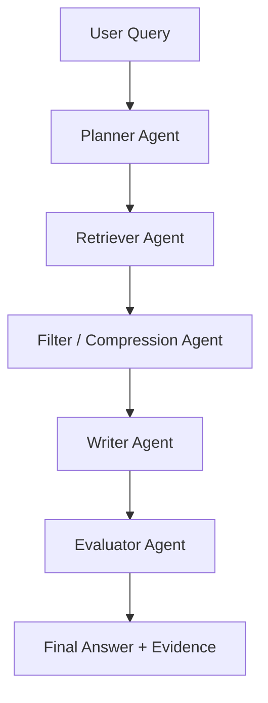

# RAG Roadmap for This Project

## Chosen direction

For this project, the clean progression is:

1. Traditional RAG
2. Advanced RAG
3. Multi-Agent RAG

Not:

1. Traditional RAG
2. Agentic RAG

## Why

You already stated the right architectural constraint:

- `Agentic RAG` is a single autonomous agent that plans internally.
- This is much closer to `LangGraph`.
- Your current architecture is closer to a controllable pipeline system where `Advanced RAG` and `Multi-Agent RAG` fit better.

So the project should improve in the following order.

## Stage 1: Traditional RAG

Current strengths:

- multiple chunking strategies
- dense, BM25, hybrid, reranked retrieval
- statistical evaluation

Current limitation:

- mostly retrieval + answer generation

## Stage 2: Advanced RAG

This should be the next real implementation target.

Add:

- query rewriting
- document cleaning / deduplication
- rerank + context compression
- citation-style grounding
- answer length control
- "I don't know" calibration

Recommended internal flow:

## Stage 3: Multi-Agent RAG

Use multiple explicit roles:

- planner
- retriever
- evidence filter
- answer writer
- evaluator

This is appropriate if you want a more explainable demo in Flowise-like tooling.

Recommended multi-agent pattern:

## Recommended project path now

### Deployment

- SCC-hosted `vLLM` backend
- OpenWebUI frontend
- Streamlit dashboard for visual explanation

### Retrieval quality

- add query rewriting
- add contextual compression
- add answer citations

### Demo quality

- let users switch between `Traditional`, `Advanced`, and later `Multi-Agent`
- show retrieved chunks
- show final answer
- show why one answer is better
