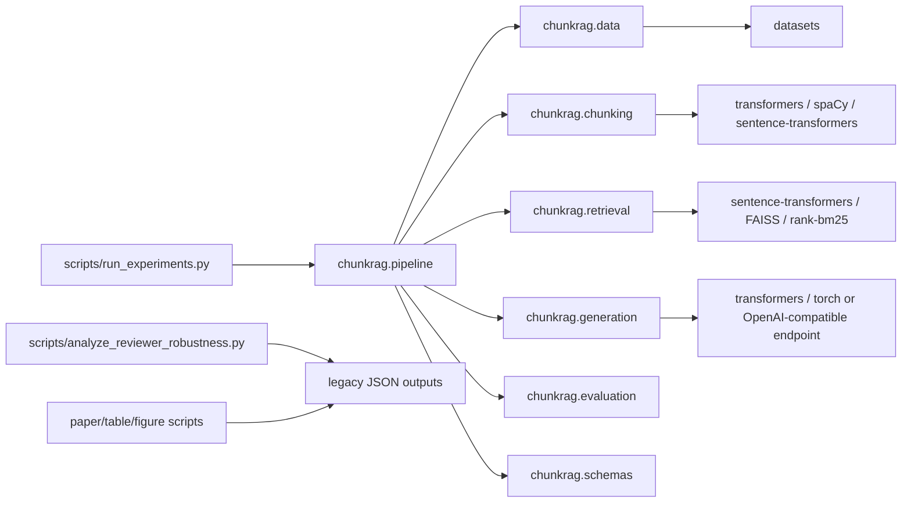
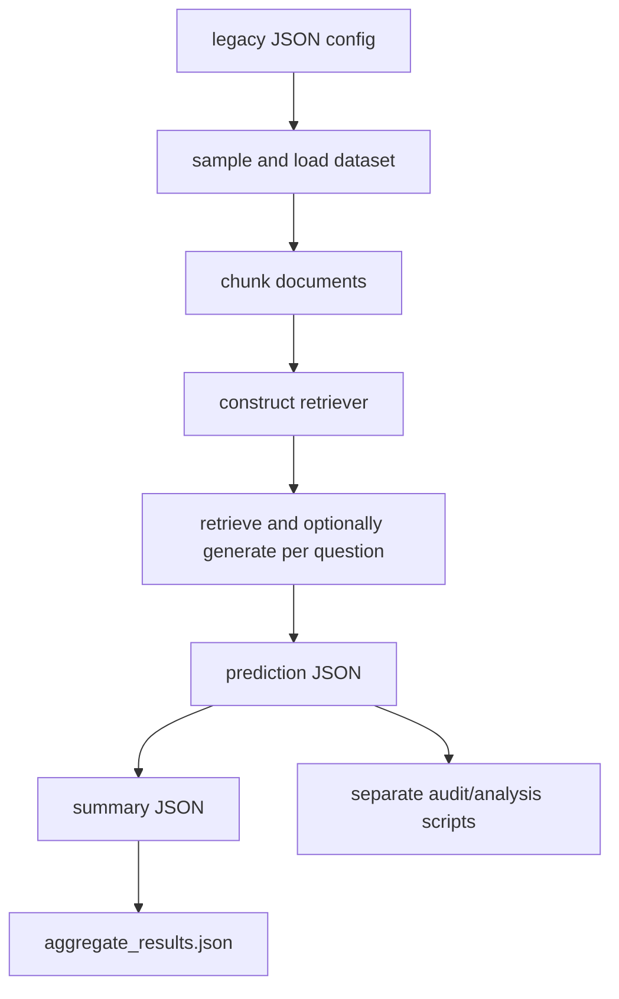
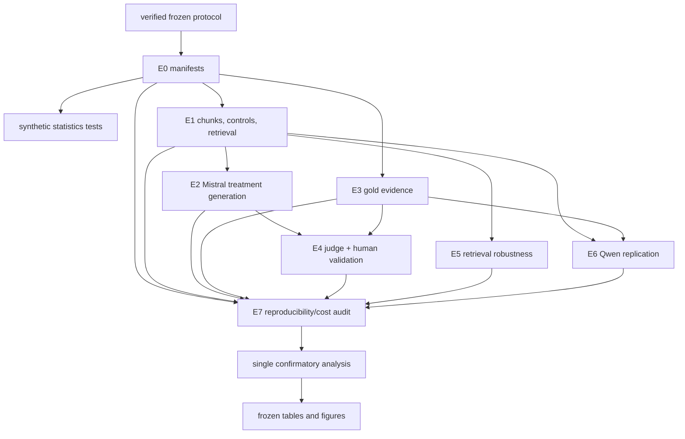
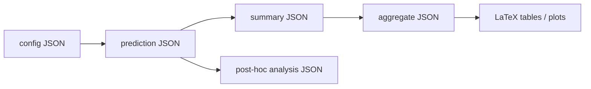
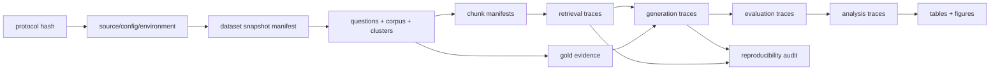
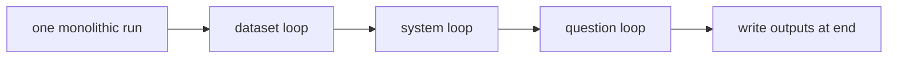

# Phase 3A Repository Audit

Protocol: `chunkrag-main-v1`  
Protocol SHA-256: `567b652fc403e7ff7e00e349de86357f9a293cac77e7e7f4d3612284eb2c89bf`  
Audit scope: implementation readiness only; no experimental output was read or produced.  
Governing sections: Immutable Specification Sections 1, 23--29, and E0--E7.

## Decision

The existing `chunkrag` package remains a legacy/pilot implementation. It cannot be the
execution engine for the frozen main study without changing its semantics in ways that
would risk both the archived analyses and the new protocol. The main study therefore
requires a separate `chunkrag.mainstudy` package that may reuse only low-level,
protocol-compatible ideas. Legacy scripts and outputs remain readable but are not inputs
to E0--E7.

This is not a stylistic rewrite. It is required by Sections 2, 23--25, and 29: the new
study needs a different data universe, chunk identity, trace granularity, hash chain,
execution order, and failure policy.

## Dependency graph

Current dependency risks:

- `pyproject.toml` specifies version ranges, while Section 27 requires exact versions.
- `requirements-reviewer-robustness.txt` is direct-only, not a resolved transitive lock.
- `pipeline.py` imports model libraries at module import time, preventing lightweight
  validation-only and merge-only use.
- Analysis code imports assumptions about legacy filenames and schemas rather than a
  versioned artifact API.
- The optional endpoint generator violates the pinned-local-model rule for primary work.

## Existing experiment graph

Protocol incompatibilities:

- Dataset sampling is shuffled by seed rather than SHA-frozen (Sections 8--10).
- SQuAD is collapsed into title-level pseudo-documents in the legacy loader rather than
  paragraph documents (Section 9.1).
- Hotpot document IDs are title-only and cannot distinguish title/text conflicts
  (Section 9.2).
- Chunkers overlap and use sizes 128/254 rather than non-overlapping target 192
  (Section 11).
- Semantic chunking uses a threshold and shared encoder assumptions rather than the
  frozen minimum-adjacent-similarity policy (Section 11.4).
- Randomized-boundary controls do not exist (Section 12).
- Retrieval produces only the final top-k and discards dense, sparse, fused, and
  reranker candidate scores (Sections 13 and 23.3).
- The current hybrid candidate pool is 20 rather than frozen top 50/top 16.
- Generation is performed immediately after retrieval and cannot reuse immutable traces
  across models and packing conditions (Sections 13.5, 16, and 29).
- Operational and exposure-matched packing do not exist (Section 16).
- Gold-evidence conditions do not exist (Section 17).
- Current bootstrap is question-level and is not cluster-aware (Section 20).
- TechQA judge validation and blinded human package do not exist (Sections 21--22).

## Required experiment graph

## Existing artifact graph

Artifact deficiencies:

- JSON is pretty-printed, insertion-ordered, and not canonical JSON/JSONL.
- There are no record hashes or immediate-upstream hashes.
- `source_tree_hash()` hashes a subset of source files and raw content directly; it is
  not the Section 24 source hash.
- Run manifests do not include dataset cache hashes, model snapshot hashes, question,
  corpus, chunk, retrieval, generation, or evaluation roots.
- Chunk records omit source character/token spans, separators, parent ordinal, and
  round-trip coverage proof.
- Retrieval records omit the full candidate lists and component ranks/scores.
- Generation records omit exact messages, token IDs, consumed source spans, packing
  target, hardware provenance, attempt history, and record hash.
- Evaluation records are aggregate-oriented and cannot trace metrics to generations.
- Writes are mutable and non-atomic; resume state is not hash-validated.

## Required artifact graph

Every arrow is an immediate-upstream SHA-256 reference. A merge must reject any broken,
mixed, duplicated, or missing link.

## Existing execution graph

Execution deficiencies:

- No stage DAG or dependency validation.
- No dry-run plan that avoids model/data loading.
- No validation-only or merge-only modes.
- No canonical shard definition, per-question checkpoint, or atomic finalization.
- Resume can only overwrite/restart an output directory.
- No clean-Git gate or protocol-checksum gate.
- No Colab/A100 canonicality gate.
- No prevention of outcome inspection before the confirmatory gate.

## Missing modules

The repository has no protocol-compliant implementation for:

1. protocol/config verification;
2. canonical JSON/JSONL and snapshot hashing;
3. immutable artifact storage and chain validation;
4. E0 SHA selection, corpus materialization, clusters, and gold manifests;
5. span-preserving 192-token chunkers;
6. deterministic jitter controls;
7. score-complete hybrid/RRF/reranker traces;
8. operational, matched, and gold context packing;
9. pinned local generation trace production;
10. semantic judge and human annotation packages;
11. cluster-aware inference and multiplicity families;
12. stage/shard planning, checkpoint, resume, merge, and Colab validation;
13. protocol coverage and one-command verification;
14. result-driven-but-layout-frozen table/figure generation.

## Obsolete code for the main study

The following remains valid only for archived/pilot work and must not be called by the
main-study runner:

- legacy configs in `configs/`;
- `scripts/run_experiments.py` and `chunkrag.pipeline`;
- endpoint generation in `chunkrag.generation`;
- Chonkie and overlapping chunkers;
- legacy bootstrap/summary functions;
- legacy robustness, failure-analysis, and report-generation scripts;
- all existing `outputs/` trees.

Nothing is deleted in Phase 3 because those files support the archived appendix and many
contain pre-existing user changes.

## Duplicated logic

- Canonical-ish JSON hashing appears independently in pipeline and bundle scripts.
- Answer normalization exists in `text_utils.py`, `failure_reanalysis.py`, and analysis
  scripts.
- Dataset-specific context rendering occurs in pipeline and audit scripts.
- Bootstrap, randomization, and Holm implementations occur in multiple scripts with
  different assumptions.
- Manifest validation is bespoke in analysis and bundle scripts.
- Model/token budget logic is split between generation and context audit scripts.

The main-study package must provide one implementation for each of these concerns and
must not import legacy equivalents.

## Hidden assumptions and technical debt

- Legacy chunk IDs depend on list position and do not survive reordering.
- Model max length is overridden to one million in one path, hiding encoder truncation.
- Exact FAISS versus approximate behavior is not encoded in artifacts.
- Tie-breaking is not uniformly deterministic.
- Generator defaults may leak from model `generation_config.json`.
- Existing tests target legacy behavior and do not assert protocol coverage.
- The default test target assumes `.venv` exists and does not isolate optional scripts.
- Import-time heavy dependencies prevent validators from running on CPU-only systems.
- Existing working tree contains extensive unrelated staged and unstaged work; Phase 3
  must edit isolated new paths and commit only intentional files.

## Audit conclusion

No implementation contradiction invalidates the frozen protocol. The repository can
support it, but only through a new isolated main-study execution path with strict
adapters at external-library boundaries. Phase 3B may proceed.
